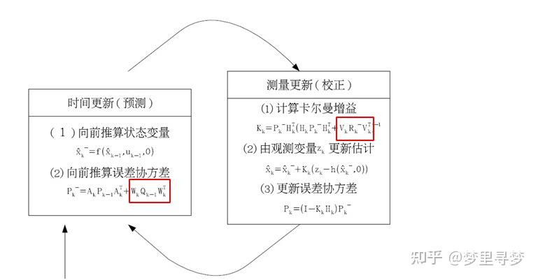

## KF原理

### 常规

我们对系统状态的分布建模为高斯分布，所以在k时刻我们需要两个信息：最佳预估值$\hat{x}_k$（平均值，有些地方也表示为u），和它的协方差矩阵$\hat{p}_k$
$$
\hat{\mathbf{x}}_k = \begin{bmatrix} \text{position} \\ \text{velocity} \end{bmatrix} \qquad \mathbf{p}_k = \begin{bmatrix} \Sigma_{pp} & \Sigma_{pv} \\ \Sigma_{vp} & \Sigma_{vv} \end{bmatrix}
$$

其中$\Sigma_{pp}$, $\Sigma{vv}$为位置、速度的协方差。
下一步，我们需要通过k-1时刻的状态来预测k时刻的状态。请注意，我们不知道状态的准确值，但是我们的预测函数并不在乎。它仅仅是对k-1时刻所有可能值的范围进行预测转移，然后得出一个k时刻新值的范围。
过一个运动公式来表示这种预测下个状态的过程：
$$
p_k = p_{k-1} + \Delta t \cdot v_{k-1} \\
v_k = v_{k-1}
$$
可化为矩阵
$$
\begin{equation}
\hat{\mathbf{x}}_k = \begin{bmatrix} 1 & \Delta t \\ 0 & 1 \end{bmatrix}
\hat{\mathbf{x}}_{k-1} \\
= \mathbf{F}_k \hat{\mathbf{x}}_{k-1}
\end{equation}
$$
现在有了一个状态转移矩阵，可以简单预测下个状态，但仍不知道如何更新协方差矩阵。这里我们需要另一个公式。如果我们对每个点进行矩阵$A$转换，它的协方差矩阵$\Sigma$会发生什么变化呢？
$$
\text{Cov}(x) = \Sigma \\
\text{Cov}(\mathbf{A}x) = \mathbf{A}x\mathbf{A}^T
$$
由(1)可得
$$
\mathbf{P}_k = \mathbf{F}_k \mathbf{P}_{k-1} \mathbf{F}_k^T
$$

### 外界作用力

我们并没有考虑到所有影响因素。系统状态的改变并不只依靠上一个系统状态，外界作用力可能会影响系统状态的变化。运动方程可以变换为
$$
p_k = p_{k-1} + \Delta t \cdot v_{k-1} + \frac{1}{2}a \Delta t^2 \\
v_k = v_{k-1} + a \Delta t
$$
矩阵形式为
$$
\hat{\mathbf{x}}_k = \mathbf{F}_k\hat{\mathbf{x}}_{k-1} + \begin{bmatrix} \frac{\Delta t^2}{2} \\ \Delta t \end{bmatrix} a \\
= \mathbf{F}_k\hat{\mathbf{x}}_{k-1} + \mathbf{B}_k \vec{u}_k
$$
其中$\mathbf{B}_k$称为控制矩阵，$\vec{u}_k$成为控制向量，没有外界动力影响情况下可以忽略此项

### 外界不确定性

现在假设预测转移矩阵不是100%准确的
如果状态只会根据系统自身特性演变那将不会有任何问题。如果我们可以把所有外界作用力对系统的影响计算清楚那也不会有任何问题。
但是如果有些外力我们无法预测呢？假如我们在跟踪一个四轴飞行器，它会受到风力影响。如果我们在跟踪一个轮式机器人，轮子可能会打滑，或者地面上的突起会使它降速。我们无法跟踪这些因素，并且这些事情发生的时候上述的预测方程可能会失灵。
我们可以把“世界”中的这些不确定性统一建模，在预测方程中增加一个不确定项。

这样，原始状态中的每一个点可以都会预测转换到一个范围，而不是某个确定的点。可以这样描述：$\hat{x}_{k-1}$中的每个点移动到一个符合方差$Q_k$的高斯分布里。另一种说法，我们把这些不确定因素描述为方差为$Q_k$的高斯噪声。
这会产生一个新的高斯分布，方差不同，但是均值相同。
对$Q_k$进行叠加，可以拿到扩展的方差，得到完整的预测转移方程
$$
\hat{\mathbf{x}}_k = \mathbf{F}_k \hat{\mathbf{x}}_{k-1} + \mathbf{B}_k \vec{u}_k \\
\mathbf{P}_k = \mathbf{F}_k \mathbf{P}_{k-1} \mathbf{F}_{k}^{T} + \mathbf{Q}_k 
$$

此时还有一个问题，$\mathbf{Q}_k$是外部环境影响的界定，那对于加速度的不确定性是包含在$\mathbf{P}_k$里还是$\mathbf{Q}_k$里面？

$\mathbf{Q}_k$应当是无法预测的误差，$\mathbf{P}_k$是系统自身的固有的不确定性

### 通过测量值精炼预测值

我们可能还有一些传感器来测量系统的状态。目前我们不用太关心所测量的状态变量是什么。也许一个测量位置一个测量速度。每个传感器可以提供一些关于系统状态的数据信息，每个传感器检测一个系统变量并且产生一些读数。

注意传感器测量的范围和单位可能与我们跟踪系统变量所使用的范围和单位不一致。我们需要对传感器做下建模：通过矩阵$\mathbf{H}_k$将状态变量转换成与传感器同样的单位。例如状态变量是记录x与y值，而传感器记录的是直接距离，那么就需要将状态变量x与y求平方和的开根号。

可以得到状态量对观测量转变的函数
$$
\vec{\mu}_{\text{expected}} = \mathbf{H}_k \hat{\mathbf{x}}_k \\
\Sigma_{\text{expected}} = \mathbf{H}_k \mathbf{p}_k \mathbf{H}_k^T
$$
其中$\mu_{\text{expected}}$代表预测的状态量的均值，$\Sigma_{\text{expected}}$是预测的状态量的方差

卡尔曼滤波也可以处理传感器噪声。换句话说，我们的传感器有自己的精度范围，对于一个真实的位置和速度，传感器的读数受到高斯噪声影响会使读数在某个范围内波动。

我们观测到的每个数据，可以认为其对应某个真实的状态。但是因为存在不确定性，某些状态的可能性比另外一些可能性更高。

我们将这种不确定性的方差为描述为$\mathbf{R}_k$，一般由厂家提供。读数的平均值为$\bar{z}_k$。也就是
$$
(\mu_1, \Sigma_1) = (z_k', \mathbf{R}_k)
$$
所以现在我们有了两个高斯分布，一个来自于我们预测值，另一个来自于我们测量值。

### 高斯乘法

高斯乘法公式
$$
\mathcal{N}\left(x, \mu_{0}, \sigma_{0}\right) \cdot \mathcal{N}\left(x, \mu_{1}, \sigma_{1}\right) = \mathcal{N}\left(x, \mu^{\prime}, \sigma^{\prime}\right) \\
\mathbf{k} = \frac{\sigma_0^2}{\sigma_0^2 + \sigma_1^2} \\
\mu' = \mu_0 + \mathbf{k}(\mu_1 - \mu_0) \\
{\sigma'}^2 = \sigma_0^2 - \mathbf{k} \sigma_0 
$$

写成多维矩阵的形式：
$$
\begin{equation}
    \mathbf{K} = \Sigma_{0} (\Sigma_{0} + \Sigma_{1})^{-1} \\
\end{equation} \\
\begin{equation}
    \vec{\mu}' = \vec{\mu_{0}} + \mathbf{K}(\vec{\mu_{1}} - \vec{\mu_{1}}), \quad
    \Sigma' = \Sigma_{0} - \mathbf{K}\Sigma_{0}
\end{equation}
$$
其中$\Sigma$称为协方差矩阵，$\bar{\mu}$表示平均向量，$\mathbf{K}$称为**卡尔曼增益**

### 综合全部信息

有两个独立的维度估计系统状态

预测值
$$
(\mu_{0}, \Sigma_{0}) = (\mathbf{H}_k \hat{\mathbf{x}}_k, \mathbf{H}_k\mathbf{P}_k\mathbf{H}_k^T)
$$
测量值
$$
(\mu_{1}, \Sigma_{1}) = (z'_{k}, \mathbf{R}_{k})
$$
带入式(3)：
$$
\begin{equation}
    \mathbf{H}_k \hat{\mathbf{x}}_k' = \mathbf{H}_k \hat{\mathbf{x}}_k + \mathbf{K}(\vec{z}_k - \mathbf{H}_k \hat{\mathbf{x}}_k)
\end{equation} \\
\begin{equation}
    \mathbf{H}_k \mathbf{P}_k' \mathbf{H}_k^T = \mathbf{H}_k \mathbf{P}_k \mathbf{H}_k^T - \mathbf{K} \mathbf{H}_k \mathbf{P}_k \mathbf{H}_k^T
\end{equation}
$$
由(2)可得
$$
\begin{equation}
    \mathbf{K} = \mathbf{H}_k \mathbf{P}_k \mathbf{H}_k^T (\mathbf{H}_k \mathbf{P}_k \mathbf {H}_k^T + \mathbf{R}_k)^{-1}
\end{equation}
$$
将(4)(5)中的$\mathbf{H}_k$从两边约去，注意(6)中的K也包含$\mathbf{H}_k$。得到
$$
\begin{align}
    \hat{\mathbf{x}_k'} &= \hat{\mathbf{x}_k} + \mathbf{K}'(\vec{z}_k - \mathbf{H}_k \hat{\mathbf{x}}_k) \\
    \mathbf{P}_k' &= \mathbf{P}_k - \mathbf{K}' \mathbf{H}_k \mathbf{P}_k \\
    \mathbf{K}' &= \mathbf{P}_k \mathbf{H}_k^T (\mathbf{H}_k \mathbf{P}_k \mathbf{H}_k^T + \mathbf{R}_k)^{-1}
\end{align}
$$
至此，我们得到了每个状态的更新步骤，$\hat{\mathbf{x}}_k'$是我们最佳的预测值，我们可以持续迭代（独立于$\mathbf{P}_k'$）。

### 总结

#### 预测未来

- 输入：**过去**的最优状态$(\hat{\mathbf{x}}_{k-1}, \mathbf{P}_{k-1})$、外界对过程的影响$\vec{\mu}_k$、环境的不确定度$\mathbf{Q}_k$
- 输出：**预测**的最佳状态$(\hat{\mathbf{x}_k}, \mathbf{P}_k)$
- 其他：对过程的描述$(\mathbf{F}_k, \mathbf{B}_k)$，与时间有关
$$
\hat{\mathbf{x}}_k = \mathbf{F}_x \hat{\mathbf{x}}_{k-1} + \mathbf{B}_k \vec{u}_k \\
\mathbf{P}_k = \mathbf{F}_k \mathbf{P}_{k-1} \mathbf{F}_k^T + \mathbf{Q}_k
$$

#### 修正当下

- 输入：**预测**的最优状态$(\hat{\mathbf{x}}_k, \mathbf{P}_{k})$，**测量**的状态分布$(\vec{z}_k, \mathbf{R}_k)$，**预测到测量**的变换矩阵$\mathbf{H}_k$
- 输出：经过测量修正的最优状态$(\hat{\mathbf{x}}_k', \mathbf{P}_k')$
$$
    \hat{\mathbf{x}_k'} = \hat{\mathbf{x}_k} + \mathbf{K}'(\vec{z}_k - \mathbf{H}_k \hat{\mathbf{x}}_k) \\
    \mathbf{P}_k' = \mathbf{P}_k - \mathbf{K}' \mathbf{H}_k \mathbf{P}_k \\
    \mathbf{K}' = \mathbf{P}_k \mathbf{H}_k^T (\mathbf{H}_k \mathbf{P}_k \mathbf{H}_k^T)
$$

## 扩展到EKF

KF的假设之一就是高斯分布的x预测后仍服从高斯分布，高斯分布的x变换到测量空间后仍服从高斯分布。可是，假如F、HF、H是非线性变换，那么上述条件则不成立。
那么我们就需要将非线性转到线性，才能使用卡尔曼滤波，这时候又要用上泰勒展开。

对于多维系统，采用泰勒一阶展开可以得到
$$
T(x) \approx f(a) + (x - a)^T Df(a)
$$
其中$Df(a)$是雅可比矩阵

以上部分借鉴知乎文章（三十九）通俗易懂理解——卡尔曼滤波与扩展卡尔曼滤波 - 梦里寻梦的文章 - 知乎https://zhuanlan.zhihu.com/p/81404580

## 再扩展到ESKF

### ESKF优点

- 在旋转的处理上，ESKF的状态变量可以采用最小化的参数表达，也就是使用三维变量来表达旋转的增量。而传统KF需要用到四元数（4维）或者更高维的表达（旋转矩阵，9维），要不就得采用带有奇异性的表达方式（欧拉角）
- ESKF总是在原点附近，离奇异点较远，并且也不会由于离工作点太远而导致线性化近似不够的问题
- ESKF的状态量为小量，其二阶变量相对来说可以忽略。同时大多数雅可比矩阵在小量情况下变得非常简单，甚至可以用单位阵代替
- 误差状态的运动学也相比原状态变量要来得更小，因为我们可以把大量更新部分放到原状态变量中

### ESKF与EKF差异

在ESKF中，我们通常把原状态变量称为**名义状态变量**（nominal state），然后把ESKF里的状态变量称为**误差状态变量**（error state）。ESKF整体流程如下：当IMU测量数据到达时，我们把它积分后，放入名义状态变量中。由于这种做法没有考虑噪声，其结果自然会快速漂移，于是我们希望把误差部分作为误差变量，放在ESKF中。ESKF内部会考虑各种噪声和零偏的影响，并且给出误差状态的一个高斯分布描述。同时，ESKF本身作为一种卡尔曼滤波器，也具有预测过程和修正过程，其中修正过程需要依赖IMU以外的传感器观测。当然，在修正之后，ESKF可以给出后验的误差高斯分布，随后我们可以把这部分误差放入名义状态变量中，并把ESKF置零，这样就完成了一次循环。

### ESKF状态方程

我们设ESKF的真值状态为$x_t = \begin{bmatrix} p_t, v_t, R_t, b_{at}, b_{gt}, g_t \end{bmatrix}^T$。这个状态随着时间而改变，在连续时间中，我们记IMU数据为$\tilde{\omega}, \tilde{\alpha}$。可以写出状态变量相对于观测量的关系式
$$
\dot p_t = v_t \\
\dot v_t = R_t(\tilde{\alpha} - b_{at} - \eta_a) + g \\
\dot R_t = R_t(\tilde{\omega} - b_{gt} - \eta_g)^\wedge \\
\dot b_{gt} = \eta_{bg} \\
\dot b_{at} = \eta_{ba} \\
\dot g = 0
$$
其中带下标t的表示真值
- $\dot p_t$ 代表位置的微分，即速度
- $\dot v_t$ 代表速度的微分，即加速度
- $R_t$ 代表旋转矩阵，描述物体的方向
- $\eta_g$ 陀螺仪的随机噪声
- $\eta_a$ 加速度计的随机噪声
- $(\tilde{\omega} - b_{gt} - \eta_g)^\wedge$ 描述旋转的微分作用
- $b_{at}$ 加速度计偏置，校正加速度测量误差
- $b_{gt}$ 陀螺仪偏置，校正角速度测量误差
- $g_t$ 重力向量，补偿重力影响
这里把重力$g$考虑进来的主要理由是方便确定IMU的初始姿态。如果我们不在状态方程里写出重力变量，那么必须事先确定初始时刻的IMU朝向$R(0)$，才可以执行后续的计算。此时IMU的姿态就是相对于初始的水平面来描述的。而如果把重力写出来，就可以设IMU的初始姿态为单位矩阵$R=I$，而把重力方向作为IMU当前姿态相比于水平面的一个度量。

下面开始推导误差状态方程
$$
p_t = p + \delta p \\
v_t = v + \delta v \\
\mathbf{R}_t = \mathbf{R} \delta \mathbf{R} \quad \text{或} \quad q_t = q \delta q \\
b_{gt} = b_g + \delta b_g \\
b_{at} = b_a + \delta b_a \\
g_t = g + \delta g
$$
其中不带下标的是**名义状态变量**
$$
\delta \dot p = \delta v \\
\delta \dot b_g = \eta_g \\
\delta \dot b_a = \eta_a \\
\delta g = 0
$$
误差状态的旋转项推导较为复杂，直接上结果:
$$
\delta \dot \theta \approx -(\tilde \omega - b_g)^\wedge \delta \theta - \delta b_g - \eta_g
$$
误差状态的速度项:
$$
\delta \dot v = - \mathbf{R}(\tilde{a} - b_a)^\wedge \delta \theta - \mathbf{R} \delta b_a - \eta_a + \delta g
$$

### 离散时间的ESKF运动学方程

名义状态变量的离散时间运动学方程可以写为：
$$
p(t + \Delta t) = p(t) + v \Delta t + \frac{1}{2} R (\tilde{a} - b_a) \Delta t^2 + \frac{1}{2} g \Delta t^2 \\
v(t + \Delta t) = v(t) + R (\tilde{a} - b_a) \Delta t + g \Delta t \\
R(t + \Delta t) = R(t) \text{Exp}((\tilde{\omega} - b_g) \Delta t) \\
b_g(t + \Delta t) = b_g(t) \\
b_a(t + \Delta t) = b_a(t) \\
g(t + \Delta t) = g(t)
$$
该式只需在上面的基础上添加零偏项与重力项即可。而误差状态的离散形式则只需要处理连续形式中的旋转部分。参考角速度的积分公式，可以将误差状态方程写为：
$$
\delta p(t + \Delta t) = \delta p + \delta v \Delta t \\
\delta v(t + \Delta t) = \delta v + \Big(- R (\tilde{a} - b_a) \land \delta \theta - R \delta b_a + \delta g \Big) \Delta t + \eta_v \\
\delta \theta(t + \Delta t) = \text{Exp} \Big( - (\tilde{\omega} - b_g)  \Delta t \Big) \delta \theta - \delta b_g \Delta t - \eta_\theta \\
\delta b_g(t + \Delta t) = \delta b_g + \eta_g \\
\delta b_a(t + \Delta t) = \delta b_a + \eta_a \\
\delta g(t + \Delta t) = \delta g
$$
注意:
- 噪声项并不参与递推，需要把它们单独归入噪声部分中。连续时间的噪声项可以视为随机过程的能量谱密度，而离散时间下的噪声变量就是我们日常看到的随机变量了。这些噪声随机变量的标准差可以列写如下:
$
\sigma(\eta_v) = \Delta t \sigma_a, \quad \sigma(\eta_\theta) = \Delta t \sigma_g, \quad \sigma(\eta_g) = \sqrt{\Delta t} \sigma_{b_g}, \quad \sigma(\eta_a) = \sqrt{\Delta t} \sigma_{b_a}
$
其中前两式的$\Delta t$是由积分关系导致的。

### ESKF的运动过程

根据上述讨论，我们可以写出 ESKF 的运动过程。误差状态变量$delta x$的离散时间运动方程已经在上式给出，我们可以整体地记为：
$$
\delta x = f(\delta x) + w, \quad w \sim \mathcal{N}(0, Q)
$$
其中$w$为噪声。按照前面的定义$Q$应该为：
$$
Q = \text{diag}(O_3, \text{Cov}(\eta_v), \text{Cov}(\eta_\theta), \text{Cov}(\eta_g), \text{Cov}(\eta_a), O_3)
$$
两侧的零是由于第一个和最后一个方程本身没有噪声导致的。
为了保持与 EKF 的符号统一，我们计算运动方程的线性化形式式：
$$
\delta x = F \delta x + w
$$

其中$\mathbf{F}$为线性化后的雅可比矩阵。由于我们列写的运动方程已经是线性化的了，只需把它们的线性系统拿出来即可：
$$
F =
\begin{bmatrix}
I & I \Delta t & 0 & 0 & 0 & 0 & 0 \\
0 & I & -R(\tilde{a} - b_a)^\land \Delta t & -R \Delta t & -R \Delta t & 0 & I \Delta t \\
0 & 0 & \text{Exp}(-(\tilde{\omega} - b_g) \Delta t) & 0 & -I \Delta t & 0 & 0 \\
0 & 0 & 0 & I & 0 & 0 & 0 \\
0 & 0 & 0 & 0 & I & 0 & 0 \\
0 & 0 & 0 & 0 & 0 & I & 0
\end{bmatrix}
$$
在此基础上，我们执行ESKF的预测过程。预测过程包括对名义状态的预测（IMU积分）以及对误差状态的预测：
$$
\delta x_{text{pred}} = \mathbf{F} \delta x \\
\mathbf{P}_{\text{pred}} = \mathbf{F} \mathbf{P} \mathbf{F}^T + \mathbf{Q}
$$
不过由于ESKF的误差状态在每次更新以后会被重置，因此运动方程的均值部分没有太大意义，而方差部分则可以指导整个误差估计的分布情况

### ESKF的更新过程

在经过预测和更新过程之后，我们修正了误差状态的估计。接下来，只需把误差状态归入名义状态，然后重置ESKF即可。归入部分可以简单地写为：
$$
p_{k+1} = p_k + \delta p_k \\
v_{k+1} = v_k + \delta v_k \\
R_{k+1} = R_k \text{Exp}(\delta \theta_k) \\
b_{g, k+1} = b_{g, k} + \delta b_{g, k} \\ 
b_{a, k+1} = b_{a, k} + \delta b_{a, k} \\
g_{k+1} = g_k + \delta g_k \\
$$

重置：
$$
\delta x = 0 \\
\mathbf{P}_{\text{reset}} = \mathbf{J}_k \mathbf{P} \mathbf{J}_k^T \\
\mathbf{J}_k = diag(\mathbf{I}_3, \mathbf{I}_3, \mathbf{J}_\theta, \mathbf{I}_3, \mathbf{I}_3) \\
\mathbf{J}_\theta = \mathbf{I} - \frac{1}{2} \delta \theta_k^\wedge
$$

## ESKF IMU-GPS实战为例

### 1.初始化

- 位置 $p = [p_x, p_y, p_z]^T$
- 速度 $v = [v_x, v_y, v_z]^T$
- 旋转矩阵 $\mathbf{R}$（或者使用四元数描述旋转）
- 陀螺仪偏置 $\mathbf{b}_g = [b{g_x}, b_{g_y}, b_{g_z}]^T$
- 加速度计偏置 $\mathbf{b}_a = [b{a_x}, b_{a_y}, b_{a_z}]^T$
- 重力向量 $\mathbf{g}$

假设系统初始状态是 $\mathbf{x}_0 = [\mathbf{p}_0, \mathbf{v}_0, \mathbf{R}_0, \mathbf{b}_g, \mathbf{b}_a, \mathbf{g}_0]^T$

$$
\mathbf{P}_0 = 
\begin{bmatrix}
P_{pp} & P_{pv} & P_{pR} & P_{pb_g} & P_{pb_a} & P_{pg} \\
P_{vp} & P_{vv} & P_{vR} & P_{vb_g} & P_{vb_a} & P_{vg} \\
P_{Rp} & P_{Rv} & P_{RR} & P_{Rb_g} & P_{Rb_a} & P_{Rg} \\
P_{b_gp} & P_{b_gv} & P_{b_gR} & P_{b_gb_g} & P_{b_gb_a} & P_{b_gg} \\
P_{b_ap} & P_{b_av} & P_{b_aR} & P_{b_ab_g} & P_{b_ab_a} & P_{b_ag} \\
P_{gp} & P_{gv} & P_{gR} & P_{gb_g} & P_{gb_a} & P_{gg} \\
\end{bmatrix} \\
= diag[p, v, R, g_b, a]
$$

### 2.预测 (IMU)

- 位置预测
$$
p_{k+1} = p_k + v \Delta t + \frac{1}{2} R_k (\tilde{a}_k - b_{ak}) \Delta t^2 + \frac{1}{2} g \Delta t^2 
$$
- 速度预测
$$
v_{k+1} = v_k + R_k (\tilde{a} - b_{ak}) \Delta t + g \Delta t
$$
- 旋转矩阵预测
$$
R_{k+1} = R_{k} \text{Exp}((\tilde{\omega}_k - b_{gk}) \Delta t)
$$
- 偏置预测
$$
cb_{g k+1} = b_{gk} + \eta_{gk} \Delta t \\
cb_{a k+1} = b_{ak} + \eta_{ak} \Delta t \\
$$
- 协方差矩阵更新
$$
\mathbf{P}_{k+1} = \mathbf{F}_k \mathbf{P}_k \mathbf{F}_k^T + \mathbf{Q}_k
$$

### 3.更新过程 (GPS)

1. 计算卡尔曼增益
$$
\mathbf{K}_{k+1} = \mathbf{P}_k \mathbf{H}_k^T (\mathbf{H}_k \mathbf{P}_k \mathbf{H}_k^T + \mathbf{R}_k)^{-1}
$$
2. 更新位置估计
$$
p_{k}' = p_k + \mathbf{K}_k(z_k - \mathbf{H}_k p_k)
$$
3. 更新协方差
$$
\mathbf{P}_k' = \mathbf{P}_k - \mathbf{K}_k \mathbf{H}_k \mathbf{P}_k
$$

这里的 ‘代表的是更新，并不是预测，与k+1有区别

以上内容借鉴https://zhuanlan.zhihu.com/p/441182819
